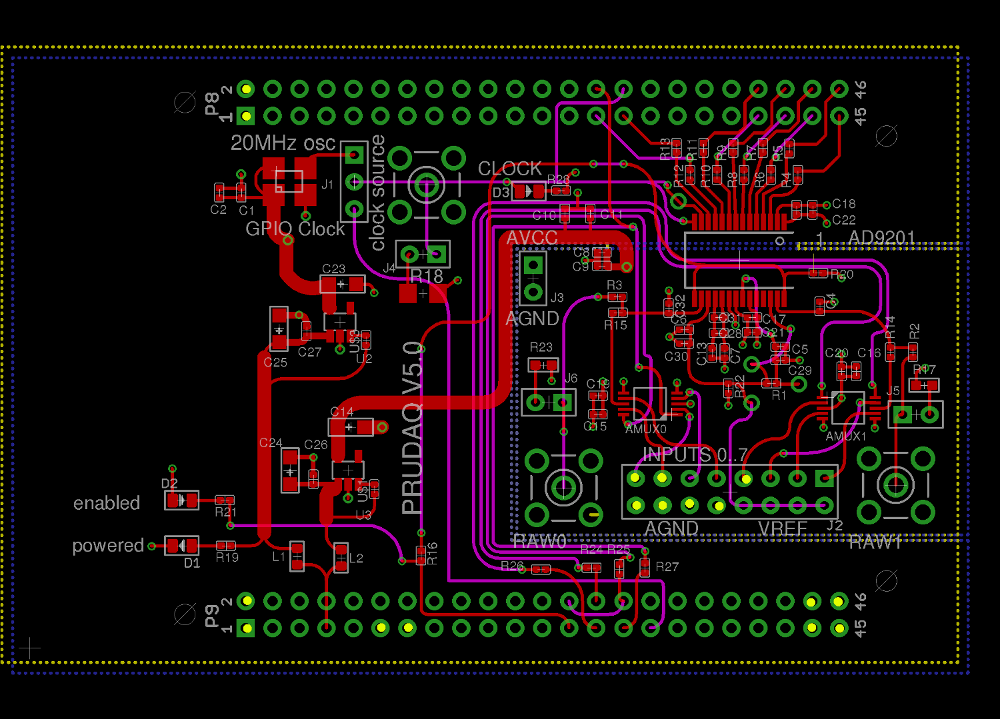

# Passive Sonar Subsystem

## Building the code
Make sure all dependiencies are installed. Check [Beaglebone Setup Guide](docs/bbb-install.md).
```
mkdir build && cd $_
cmake ..
make
```
*Please note that the Beaglebone specific code only compiles on a Beaglebone. It will exit cleanly without compiling on any other system.*

## Running the code
Each command is run from the root in this example.
* Setup IO `./scripts/setup_pins.sh`
* Start the data acqusition server `sudo ./build/pru_read ./pru_firmware/pru0-clock.bin ./pru_firmware/pru1-read-data.bin`

### Saving pings to csv
* Run the python processing code `python ./scripts/save_ping.py path [--angle angle]`.

## Wiring Guide
| Input          	| BBB Pinout                                 	| Description                                    	|
|----------------	|--------------------------------------------	|------------------------------------------------	|
| Hydrophone A   	| ANALOG_INPUT 0                             	| Preprocessed hydrophone A input                	|
| Hydrophone B   	| ANALOG_INPUT 1                             	| Preprocessed hydrophone B input                	|
| Hydrophone Ref 	| ANALOG_INPUT 4                             	| Preprocessed ref hydrophone input              	|
| Analog Ground  	| AGND (4 available)                         	| Analog ground                                  	|
| Ping available 	| P8_16 and P8_20                            	| Ping available signal from preprocesser to BBB 	|
| UART TX        	| BBB RX (P9_11)                             	| Teensy serial communication TX                 	|
| UART RX        	| BBB TX (P9_13)                             	| Teensy serial communication RX                 	|
| DGND           	| BBB GND Pins (P8_1,2 + P9_1,2 + P9_43..46) 	| Digital ground                                 	|

Yellow dots in the image below show the specified BBB pins.


## Documentation
* [Beaglebone Setup Guide](docs/bbb-install.md)
* [Beaglebone Internal Pinout](docs/pinout.md)
* [Preprocessor documentation](preprocessor_firmware/README.md)
* [Preprocessor communication interface](preprocessor_firmware/docs/CommInterface.md)
