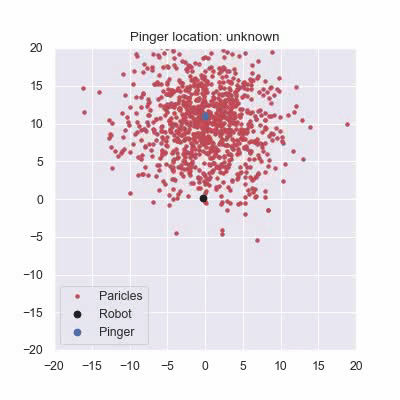
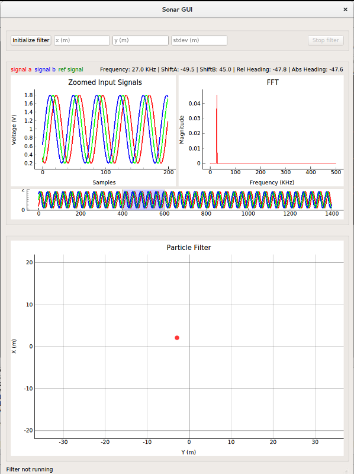

# Passive Sonar Triangulation System



The sonar system is divided into two parts:
* Sonar DAQ system (on Beaglebone)
* Sonar processing system (on TX2)

The systems communicate using ZMQ; Sonar DAQ runs a ZMQ command server (port 6868) to forward commands to preprocessor. It also publishes all serial data over a ZMQ publisher (port 6969).

All procecssing is done using a particle filter. The filter requires an initial estimate and std deviation. The filter returns the best particle (location of pinger) and the covariance of the filter. 

## Building the code

#### Beaglebone Specific Code
Make sure all dependencies are installed. Check [Beaglebone Setup Guide](docs/bbb-install.md).
Debugging information can be enabled to allow for debugging through GDB by setting the `DEBUG` flag to 1.
```
cd beaglebone
mkdir build && cd $_
cmake [-DTESTS=0/1] [-DDEBUG=0/1] ..
make
```

#### ROS Based code
Compile with `catkin_make`

## Running the code

#### Beaglebone Data Acqusition Server
Run `beaglebone/run.sh`

#### ROS node
Run `roslaunch au_sonar sonar.launch`.
Start the particle filter by publishing to `/sonar/ctrl` topic.

#### Simulator mode
Run `roslaunch au_sonar sonar_sim.launch`


#### GUI
Run `rosrun au_sonar sonar_gui.py`



## Sonar node details
#### Topics

* `/topic/sensor/sonar/output: "/sonar/output"`: output of sonar system
* `/topic/sensor/sonar/ctrl: "/sonar/ctrl"`: used to enable and disable the particle filter
* `/topic/sensor/sonar/debug: "/sonar/debug"`: debug data used by sonar GUI

## Documentation
* [Sonar Simulator](docs/simulator.md)
* [Wiring Guide](docs/wiring.md)
* [Preprocessor documentation](preprocessor_firmware/README.md)
* [Preprocessor communication interface](preprocessor_firmware/docs/CommInterface.md)
* [Beaglebone Setup Guide](docs/bbb-install.md)
* [Beaglebone Internal Pinout](docs/pinout.md)
