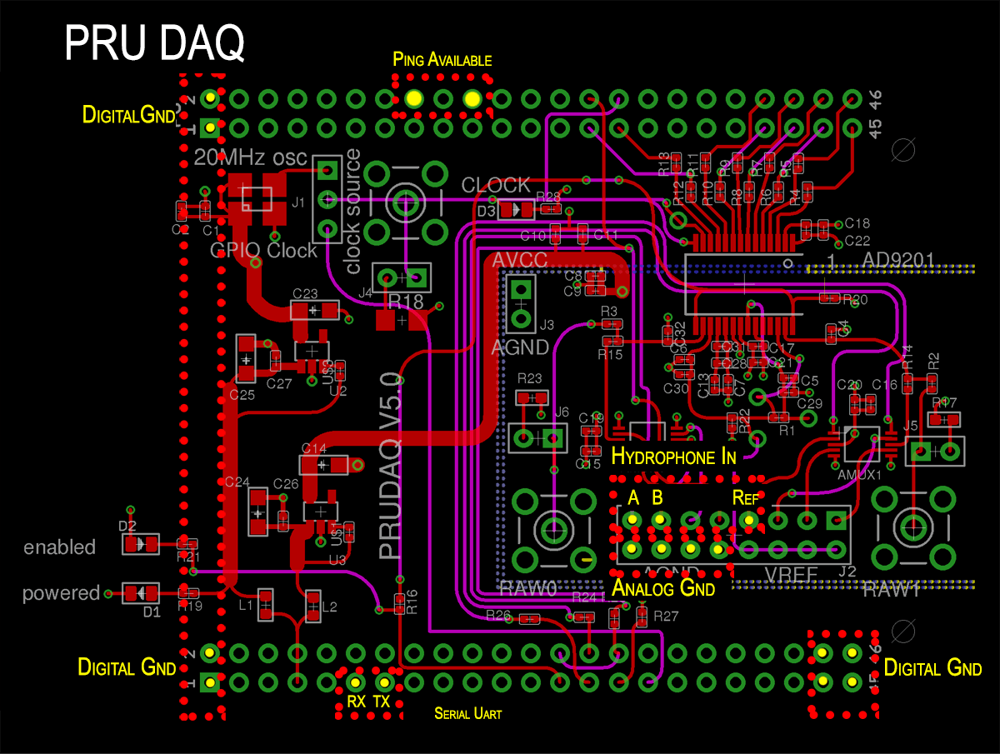
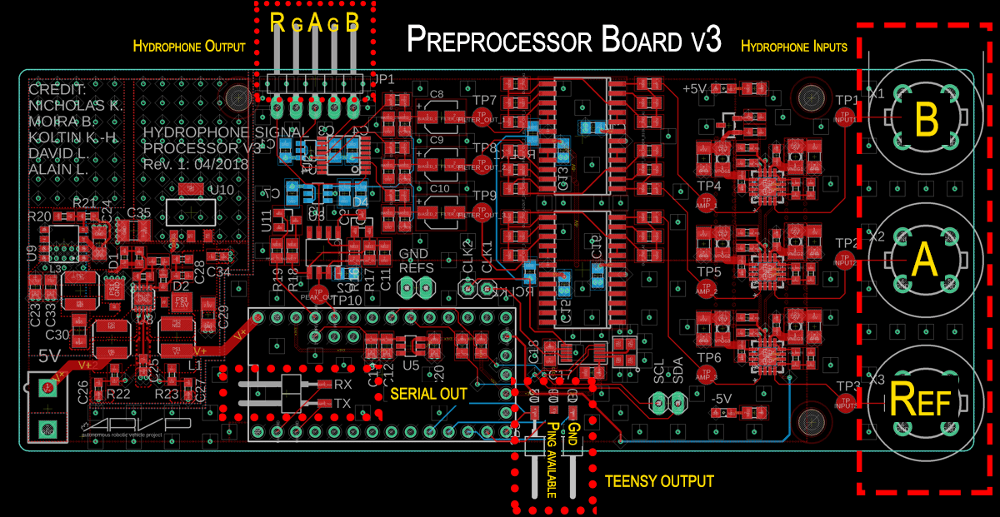

## Wiring Guide

| Input          	| BBB Pinout                                 	| Description                                    	|
|----------------	|--------------------------------------------	|------------------------------------------------	|
| Hydrophone A   	| ANALOG_INPUT 0                             	| Preprocessed hydrophone A input                	|
| Hydrophone B   	| ANALOG_INPUT 1                             	| Preprocessed hydrophone B input                	|
| Hydrophone Ref 	| ANALOG_INPUT 4                             	| Preprocessed ref hydrophone input              	|
| Analog Ground  	| AGND (4 available)                         	| Analog ground                                  	|
| Ping available 	| P8_16 and P8_20                            	| Ping available signal from preprocesser to BBB 	|
| UART TX        	| BBB RX (P9_11)                             	| Teensy serial communication TX                 	|
| UART RX        	| BBB TX (P9_13)                             	| Teensy serial communication RX                 	|
| DGND           	| BBB GND Pins (P8_1,2 + P9_1,2 + P9_43..46) 	| Digital ground                                 	|

Notes: 
* For serial UART, preprocessor RX needs to connect to Beaglebone TX, and vice versa.
* The same ping available signal goes from preprocessor board to both ping available pins on PRUDAQ.
